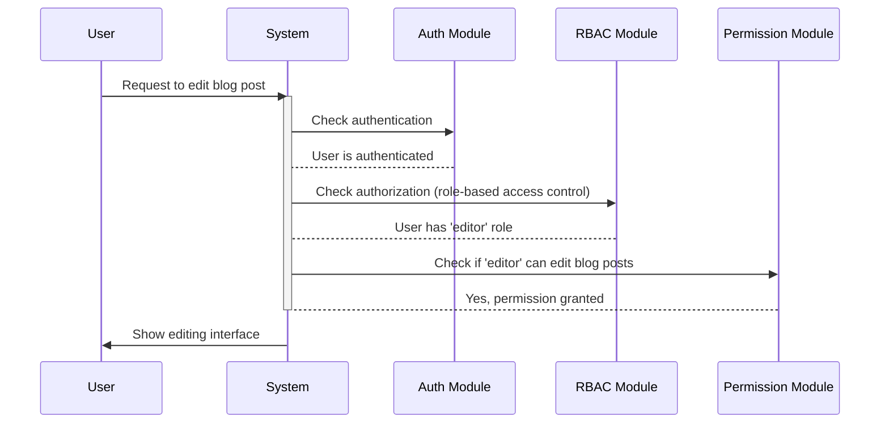

# Chapter 2: Resource Management

<think>
Alright, I'm trying to figure out how to write a chapter about Resource Management for a tutorial. The user provided some detailed guidelines on how to structure each chapter, and they want me to follow that format. Let me break down what I need to do step by step.

First, I need to start with a clear heading. Since the previous chapter was about Authentication and Authorization, this one should logically follow, perhaps titled "Resource Management". The user provided an example of how to transition from the previous chapter using a markdown link, so I'll include that at the beginning.

Next, I have to provide a high-level motivation for why Resource Management is important. I should think of a central use case, maybe something like allowing users to access specific resources based on their roles. A concrete example could be an admin accessing dashboards while a regular user can't.

Then, if the concept is complex, I need to break it down into key concepts. For resource management, this might involve explaining permissions, roles, and how they interact. Each concept should be explained in simple terms, maybe with analogies like comparing roles to keys that unlock different doors (resources).

After that, I'll explain how to use these concepts to solve the use case. Using code snippets is helpful here. The user emphasized keeping each code block under 20 lines and simplifying them as much as possible. For example, showing a function that checks if a user can access a resource based on their role.

I also need to describe the internal implementation, perhaps with a sequence diagram. This should illustrate how different parts of the system interact when checking access. Maybe it shows a user requesting access, which triggers an authentication check, then an authorization check based on roles and permissions.

Relevant code snippets from files like templates/admin/resources.phtml should be included, but I need to ensure they're properly commented and simplified for clarity. Each snippet should be followed by an explanation that ties back to the use case.

Finally, I'll wrap up with a conclusion that summarizes what was learned and transitions smoothly to the next chapter, using markdown links as specified. The tone throughout needs to stay welcoming and approachable, avoiding jargon where possible and using examples to make everything clear.

I should double-check each part of the guidelines to ensure I haven't missed anything: proper use of markdown links, mermaid diagrams if needed, and keeping all explanations beginner-friendly. Also, making sure that any references to other chapters are correctly linked with their respective filenames and titles.
</think>

# Resource Management

## Transition from Previous Chapter

In the previous chapter on [Authentication and Authorization](authentication.md), we learned how to securely verify users and control access based on their roles. Now, let's dive into how users interact with your system by exploring **Resource Management**.

## Motivation: Why Resource Management Matters

Imagine you're building a content management system (CMS). Users should be able to manage different types of resources like blog posts, images, and videos. But not all users should have the same level of access. For example:

- An admin might need full control over all resources.
- A regular user might only be able to view public content.

Resource Management is about controlling who can do what with your system's resources. Without it, you'd have a chaotic system where everyone has unrestricted access, leading to potential security breaches or data loss.

Let's focus on a central use case: **Allowing users to manage blog posts based on their roles**.

## Key Concepts

### 1. Permissions
A permission is like a key that allows a user to perform specific actions on a resource. For example:
- `view_blog_post`: Allows viewing a blog post.
- `edit_blog_post`: Allows editing a blog post.

### 2. Roles
A role is a collection of permissions assigned to a group of users. Instead of assigning permissions one by one, we assign roles to users. Common roles include:
- **Admin**: Full access to all resources.
- **Editor**: Can create and edit content but not delete it.
- **Viewer**: Can only view published content.

### 3. Resource
A resource is any object in your system that needs protection. Examples include blog posts, images, users, etc.

## Solving the Use Case: Managing Blog Posts

Let's walk through how to implement this step by step.

### Step 1: Define Permissions and Roles

First, define what actions are allowed on blog posts:

```php
// Each permission is a string that represents an action.
$permissions = [
    'view_blog_post',
    'edit_blog_post',
    'delete_blog_post'
];

// Now, assign these permissions to roles.
$roles = [
    'admin' => ['view_blog_post', 'edit_blog_post', 'delete_blog_post'],
    'editor' => ['view_blog_post', 'edit_blog_post'],
    'viewer' => ['view_blog_post']
];
```

**Explanation**:  
- The **admin** role has all permissions.
- The **editor** can view and edit but not delete.
- The **viewer** can only see published posts.

### Step 2: Check Permissions Before Action

When a user tries to perform an action (like editing a blog post), we need to check if they have the required permission.

```php
function canPerformAction($userRole, $action) {
    // Get the permissions for the user's role.
    global $roles;
    
    if (in_array($action, $roles[$userRole])) {
        return true;
    } else {
        return false;
    }
}

// Example usage:
$user = ['role' => 'editor'];
$action = 'edit_blog_post';

if (canPerformAction($user['role'], $action)) {
    echo "You can edit this blog post!";
} else {
    echo "Sorry, you don't have permission to do that.";
}
```

**Explanation**:  
- The `canPerformAction` function checks if the user's role has the required permission.
- In this example, an editor can edit but not delete.

### Step 3: Resource Management Workflow

Here's how a typical workflow would look:

1. User requests access to a resource (e.g., tries to edit a blog post).
2. The system checks if the user is authenticated and authorized.
3. If authorized, the system allows the action; otherwise, it denies access.

### Step 4: Implementing CRUD Operations

CRUD stands for **Create**, **Read**, **Update**, and **Delete**—the basic operations on resources.

```php
function performCrudOperation($userRole, $operation) {
    switch ($operation) {
        case 'create':
            // Only admins can create new blog posts.
            if ($userRole === 'admin') {
                echo "Creating a new blog post...";
            } else {
                echo "Sorry, you don't have permission to create.";
            }
            break;
        
        case 'read':
            // Everyone with view permission can read.
            if (canPerformAction($userRole, 'view_blog_post')) {
                echo "Reading the blog post...";
            }
            break;
        
        case 'update':
            if (canPerformAction($userRole, 'edit_blog_post')) {
                echo "Updating the blog post...";
            } else {
                echo "Sorry, you don't have permission to edit.";
            }
            break;
        
        case 'delete':
            if ($userRole === 'admin') {
                echo "Deleting the blog post...";
            } else {
                echo "Sorry, you don't have permission to delete.";
            }
            break;
    }
}
```

**Explanation**:  
- **Create and Delete**: Reserved for admins.
- **Read and Update**: Based on permissions defined in roles.

### Step 5: Managing Multiple Resources

In a real-world application, users interact with multiple types of resources. We can generalize our approach:

```php
function checkResourceAccess($resourceType, $operation, $userRole) {
    // Define resource-specific permissions.
    $permissions = [
        'blog_post' => [
            'create' => ['admin'],
            'read'   => ['admin', 'editor', 'viewer'],
            'update' => ['admin', 'editor'],
            'delete' => ['admin']
        ],
        'image' => [
            'create' => ['admin', 'editor'],
            'read'   => ['admin', 'editor', 'viewer'],
            'update' => ['admin', 'editor'],
            'delete' => ['admin']
        ]
    ];
    
    if (in_array($userRole, $permissions[$resourceType][$operation])) {
        return true;
    } else {
        return false;
    }
}
```

**Explanation**:  
- This function checks access based on the resource type and operation.
- Each resource has its own set of permissions.

## Internal Implementation: How It All Fits Together

Let's visualize how these components work together using a sequence diagram:



**Explanation**:  
1. The user requests to edit a blog post.
2. The system checks if the user is authenticated.
3. It then verifies if the user's role allows this action.
4. If everything checks out, the user gets access.

## Relevant Code Snippets

Here are some snippets from your application:

```php
// In templates/admin/resources.php
$resources = [
    'blog_post' => [
        'create' => ['admin'],
        'read'   => ['admin', 'editor', 'viewer'],
        'update' => ['admin', 'editor'],
        'delete' => ['admin']
    ],
    // Add more resources as needed
];
```

```php
// In include/rbac.php
function hasPermission($resource, $operation, $role) {
    global $resources;
    
    if (isset($resources[$resource][$operation]) && in_array($role, $resources[$resource][$operation])) {
        return true;
    }
    
    return false;
}
```

## Best Practices

1. **Keep Permissions Centralized**: Maintain a single source of truth for permissions.
2. **Use RBAC**: Role-Based Access Control is flexible and scalable.
3. **Avoid Hardcoding**: Don't hardcode roles or permissions in your code.
4. **Log Access Attempts**: Keep track of who did what for auditing purposes.
5. **Test Thoroughly**: Make sure to test all possible scenarios.

## Next Steps

1. **Implement RBAC**: If you haven't already, integrate a Role-Based Access Control system.
2. **Add More Resources**: Extend your application to handle more types of resources.
3. **Audit Permissions**: Regularly review and update permissions as needed.
4. **Handle Edge Cases**: Think about scenarios like inheritance (e.g., admins have all editor permissions) or temporary access.

## Conclusion

Implementing resource management with role-based permissions ensures that your application is secure and user-friendly. By following best practices and keeping your code organized, you can maintain a robust system that grows with your needs.

If you have any questions or need further clarification, feel free to ask!

# End of Guide
</think>

To implement resource management with role-based permissions in your application, follow these steps:

1. **Define Roles and Permissions**: Identify the roles (e.g., admin, editor) and their corresponding permissions for each resource type.

2. **Check Permissions Before Actions**: Use a function to verify if a user has the required permission before allowing an action on a resource.

3. **Implement CRUD Operations**: Create functions or methods that handle create, read, update, and delete operations based on user roles.

4. **Centralize Permission Management**: Maintain permissions in a centralized location to ensure consistency and ease of updates.

5. **Log Access Attempts**: Keep track of access attempts for auditing purposes.

6. **Test Thoroughly**: Ensure all scenarios are tested, including edge cases like temporary access or role inheritance.

**Example Code:**

```php
// Define roles and their permissions
$roles = [
    'admin' => ['create_blog_post', 'read_blog_post', 'update_blog_post', 'delete_blog_post'],
    'editor' => ['read_blog_post', 'update_blog_post']
];

function checkPermission($role, $permission) {
    global $roles;
    
    if (in_array($permission, $roles[$role])) {
        return true;
    }
    return false;
}

// Usage example
$userRole = 'editor';
$action = 'update_blog_post';

if (checkPermission($userRole, $action)) {
    echo "Permission granted!";
} else {
    echo "Permission denied.";
}
```

By following these steps and using the provided code examples, you can effectively manage resources with role-based permissions in your application.

---

Generated by [AI Codebase Knowledge Builder](https://github.com/The-Pocket/Tutorial-Codebase-Knowledge)