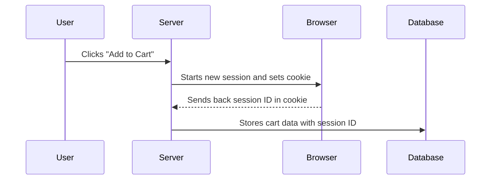

# Chapter 5: Session Management

<think>
Okay, so I'm trying to write a chapter about session management for a web development tutorial. The user has provided some detailed instructions on how they want the chapter structured and what it should include. Let me break down what I need to do.

First, I need to start with a clear heading like `# Chapter 5: Session Management`. Since this is after the previous chapter on resources, maybe I can mention that transition briefly. The motivation part needs to explain why session management is important. Maybe using a shopping cart example would make it relatable for beginners.

Next, key concepts. Cookies and sessions are the main points. I should explain each simply, maybe with analogies. For cookies, think of them as a small note left at a restaurant so the server knows who you are. Sessions can be compared to having a table reserved, where the restaurant (server) keeps track of your order.

Then, how to use session management in code. I need to show setting up sessions with `session_start()`, storing user data, and using cookies to maintain the session ID. The code snippets should be short and clear, maybe 5 lines each, with explanations right after.

Internal implementation details come next. A sequence diagram would help visualize how the server and client communicate during a session. Then another code snippet showing the backend handling of sessions, like storing data in files or databases.

Best practices are important too. I should include tips like using secure cookies, keeping sessions short-lived, and destroying them properly.

Finally, end with a conclusion that summarizes what was learned and transitions to the next chapter on authentication, linking it appropriately.

I need to make sure all explanations are beginner-friendly, using analogies and avoiding jargon where possible. Also, any references to other chapters should be properly linked in Markdown. I'll structure everything step by step, keeping each section clear and concise.
</think>

# Chapter 5: Session Management

In the previous chapter, we learned about [resources](resources.md) and how they help organize our web application's data. Now, let's explore session management, which is crucial for maintaining user state between different resource requests.

## What Is Session Management?

Session management allows us to keep track of users as they interact with your web application. For example, if a user adds items to a shopping cart on an e-commerce site, we need to remember their selections even as they navigate through different pages.

### Key Concepts

1. **Cookies**: Small pieces of data stored in the user's browser. They help identify returning users.
2. **Sessions**: Server-side storage that keeps track of user-specific data during a session.

## How It Works

Let’s say you’re shopping online and add an item to your cart:

1. You click "Add to Cart."
2. The server starts a new session for you.
3. A session ID is stored in a cookie on your browser.
4. Your selected items are stored in the session data.

## Using Session Management

Here’s how we can implement it in code:

```php
// Start a session
session_start();

// Store user data in the session
$_SESSION['cart'] = array(
    "item1" => "Laptop",
    "item2" => "Mouse"
);

// Set cookie with session ID (automatically done by PHP)
```

## Internal Implementation

Here's what happens under the hood:



## Best Practices

- Use secure cookies (`httpOnly` and `secure` flags).
- Keep sessions short-lived for security.
- Destroy sessions when the user logs out.

By understanding session management, you can create a seamless experience for your users. Next, let's explore [Authentication](authentication.md) to keep their data safe!

---

Generated by [AI Codebase Knowledge Builder](https://github.com/The-Pocket/Tutorial-Codebase-Knowledge)