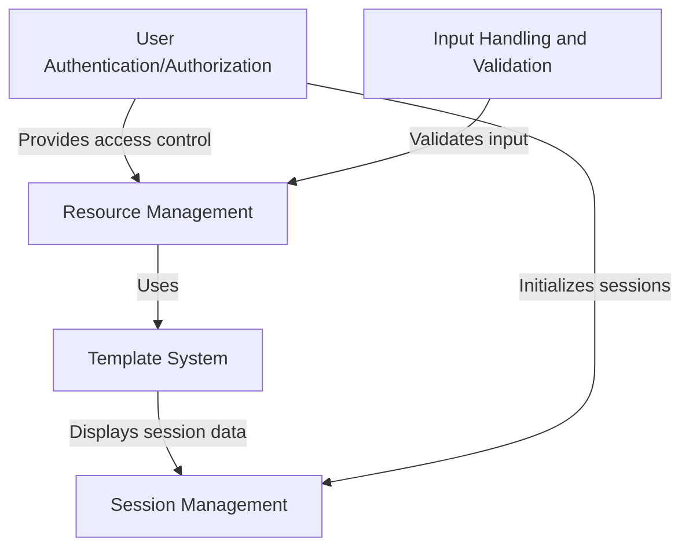

# Tutorial: admin

The **admin panel** is a system that allows users to manage website resources securely. It uses the *Template System* to present data neatly and ensures only authorized users can access features through *User Authentication*. It handles user inputs safely, manages sessions to keep users logged in, and lets admins create, edit, or delete resources.

**Source Repository:** [None](None)

## Chapters

1. [User Authentication/Authorization](01_user_authentication_authorization.md)
2. [Resource Management](02_resource_management.md)
3. [Template System](03_template_system.md)
4. [Input Handling and Validation](04_input_handling_and_validation.md)
5. [Session Management](05_session_management.md)

---

Generated by [AI Codebase Knowledge Builder](https://github.com/The-Pocket/Tutorial-Codebase-Knowledge)